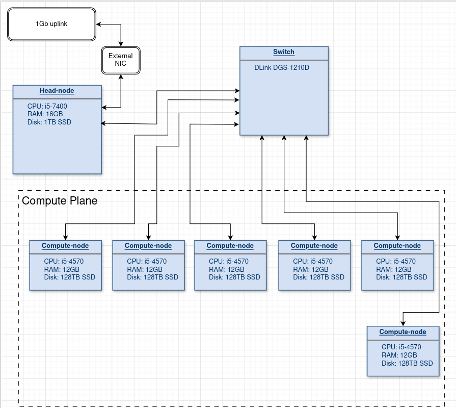

# ChaosPlex the Optiplex Compute Cluster
A diy compute cluster of 6 nodes for number crunching with MPI, based on Slurm and Warewulf

## Why
I decided to do this for two main reasons:
1. I am, and was, fascinated by distributed computing and number crunching systems
2. I has aquired 3 of the six Optiplexes reallt cheap which jump started the thing
The project allowed me to learn a ton about HPC and distrubuted systems

## Network Diagram

## Stats
## Cluster Overview

| Component    | Spec                      |
|--------------|---------------------------|
| Nodes        | 6x Dell Optiplex 9020 SFF |
| CPU          | Intel i5-4570             |
| Total Cores  | 24C / 24T                 |
| RAM          | 72 GB total               |
| Storage      | SATA SSDs                 |
| Network      | 1 Gbps Ethernet           |
| Scheduler    | Slurm                     |
| Provisioning | Warewulf (iPXE)           |
## Physical Cluster

